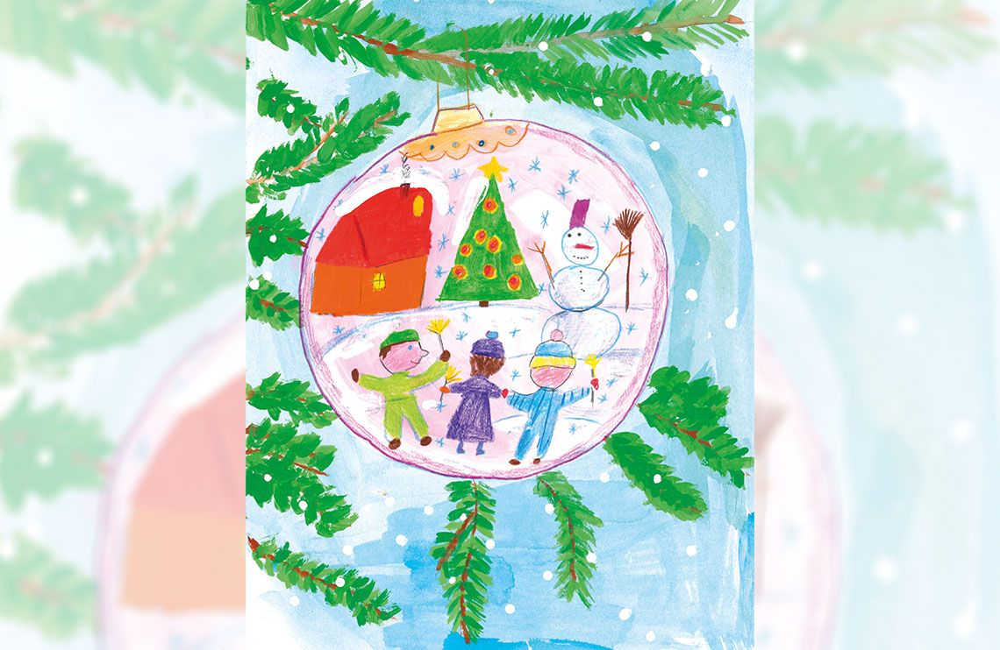

# PIN macht Schule — Gewinner

🌐 **Live Website:** [https://pin-macht-schule-katja-win.vercel.app](https://pin-macht-schule-katja-win.vercel.app)  
🏛️ **Archived Original (Wayback Machine):** [pin-macht-schule.de (Nov 2019 Snapshot)](https://web.archive.org/web/20191111202148/https://pin-macht-schule.de/)

A responsive static showcase website for the **PIN macht Schule** art competition (*Sonderstempel- und Briefmarken-Wettbewerb für Berliner Grundschulen*).

* **Author / Artist:** Ekaterina (Katja) Bazhanova
* **School:** Lomonossow-Grundschule (Berlin)
* **Competition Category:** Gewinnermotiv Klasse 1–2
* **Task Theme:** Stamp Design Competition — "Weihnachten" (Christmas / Winter)
* **Timeframe:** 2018 (Awarded December 2018)

---

## 🏆 Featured Winners (2018)

### Gewinnermotiv Klasse 1–2
<p align="center">
  <a href="https://pin-macht-schule-katja-win.vercel.app" target="_blank">
    
  </a>
</p>

### Lomonossow-Grundschule — Preisverleihung
<p align="center">
  <a href="https://pin-macht-schule-katja-win.vercel.app" target="_blank">
    
  </a>
</p>

---

## 🚀 Deployment Options

### Vercel CLI (Recommended)

1. **Install Vercel CLI:**
   ```bash
   npm i -g vercel