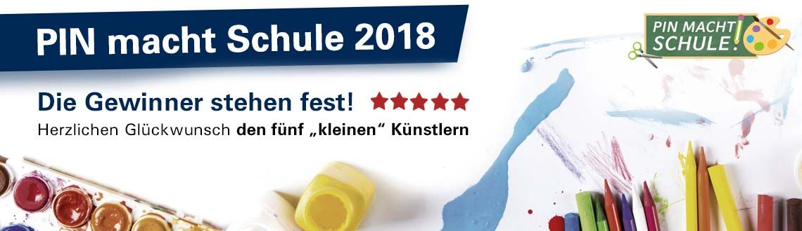
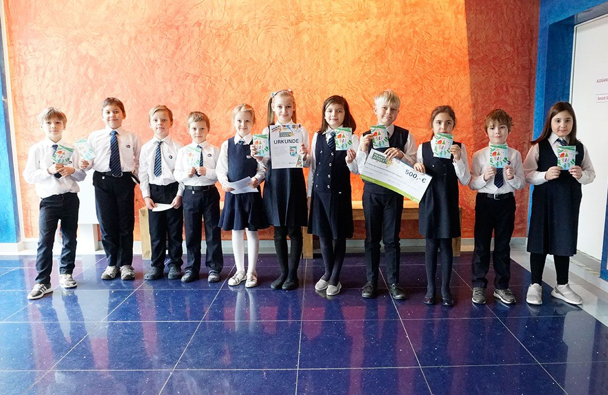
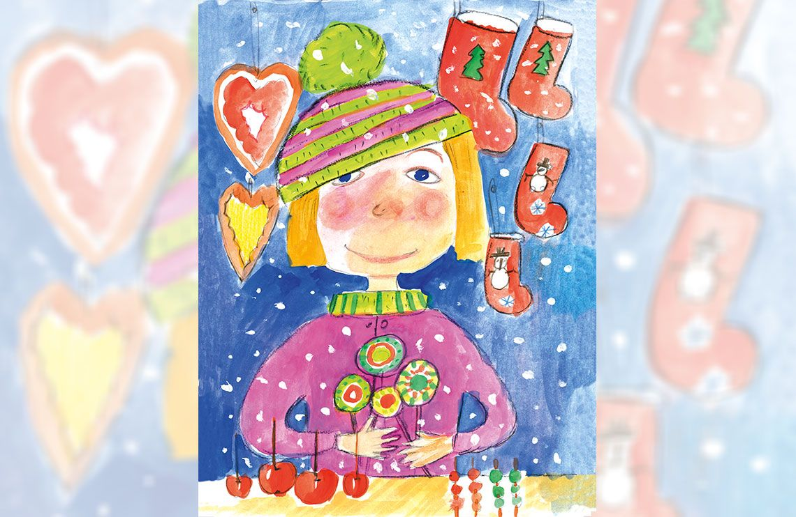
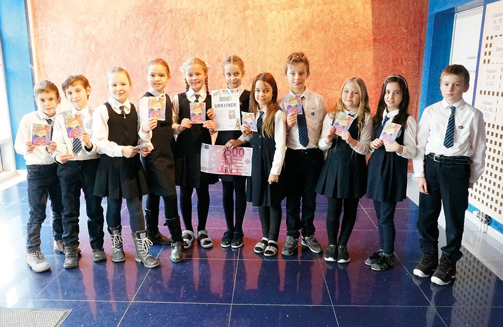
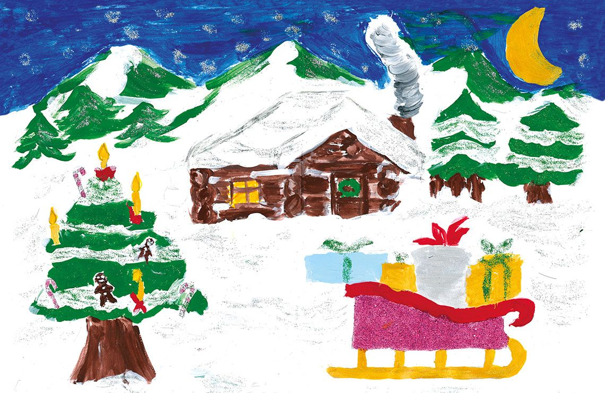
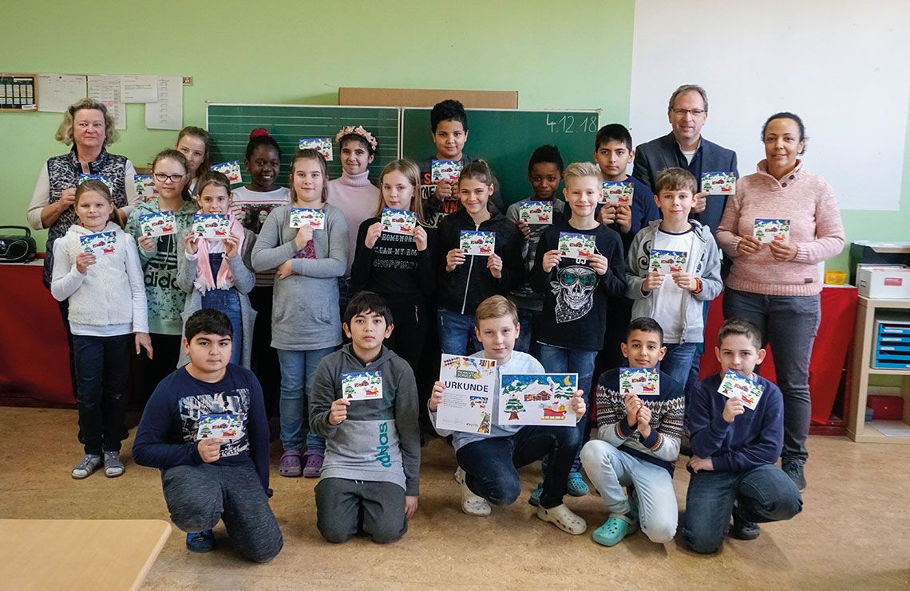
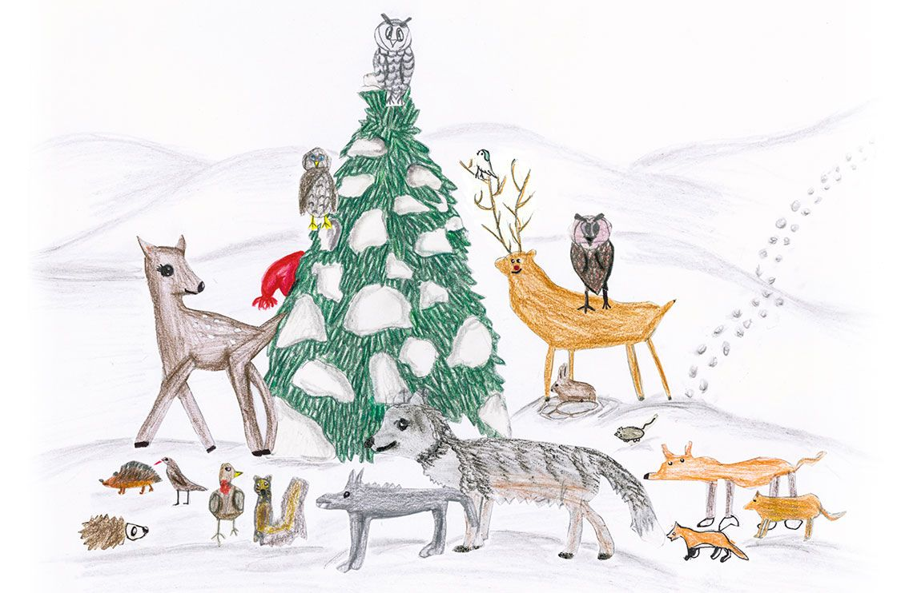
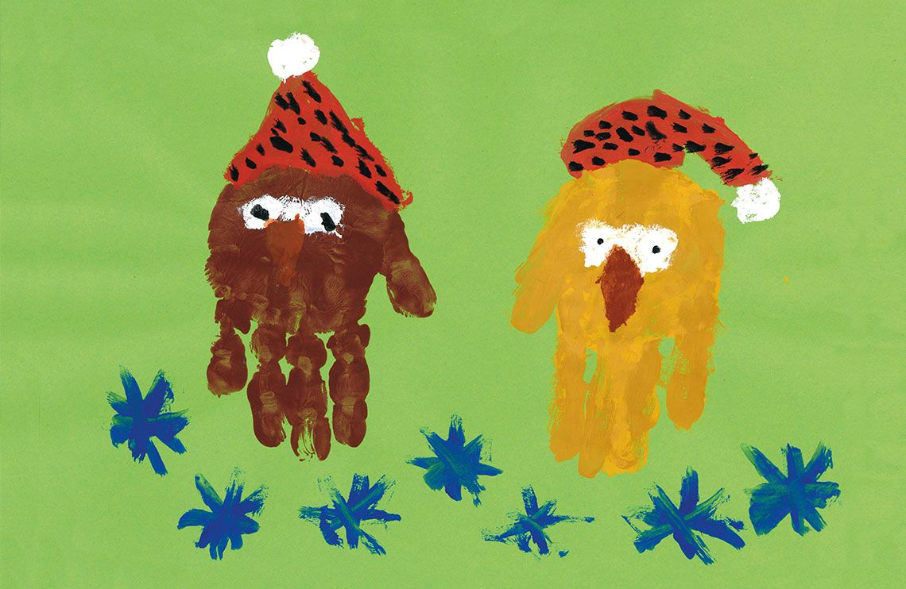
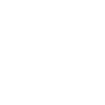

<!DOCTYPE html>
<html lang="de">
<head>
    <meta charset="UTF-8">
    <meta name="viewport" content="width=device-width, initial-scale=1.0">
    <title>PIN macht Schule — Gewinner 2018</title>

    <!-- Vercel Web Analytics -->
    

    <!-- Open Graph / Meta Tags -->
    <meta property="og:type" content="website">
    <meta property="og:url" content="https://pin-macht-schule-katja-win.vercel.app/">
    <meta property="og:title" content="PIN macht Schule 2018 — Gewinner Katia (Lomonossow-Grundschule)">
    <meta property="og:description" content="Gewinnermotiv Klasse 1–2 (Christbaumkugel) von Katia (Ekaterina Bazhanova) — Lomonossow-Grundschule Berlin.">
    <meta property="og:image" content="https://pin-macht-schule-katja-win.vercel.app/assets/pin_macht_schule_2018_gewinnermotive_klasse-1-2.jpg">

    <!-- Twitter Card -->
    <meta name="twitter:card" content="summary_large_image">
    <meta name="twitter:title" content="PIN macht Schule 2018 — Gewinner Katia">
    <meta name="twitter:description" content="Gewinnermotiv Klasse 1–2 von Katia (Ekaterina Bazhanova) — Lomonossow-Grundschule Berlin.">
    <meta name="twitter:image" content="https://pin-macht-schule-katja-win.vercel.app/assets/pin_macht_schule_2018_gewinnermotive_klasse-1-2.jpg">

    <!-- CSS Files -->
    <link rel="stylesheet" href="assets/css_xk9mMWFa_7xPuj9GRkROb4jde2uUqfm0CEAH4OjG288.css">
    <link rel="stylesheet" href="assets/css_xE-rWrJf-fncB6ztZfd2huxqgxu4WO-qwma6Xer30m4.css">
    <link rel="stylesheet" href="assets/css_Thp1QEB4qoB5nfa5xS7vRV6wtSxY0aHxZzTykwhQUDg.css">

    
</head>
<body>

<header class="site-header">
    

        
    

    

        
    

</header>

<main class="main-content">
    <section class="intro">
        <h1>PIN macht Schule</h1>
        
Sonderstempel- und Briefmarken-Wettbewerb für Berliner Grundschulen.

        

            🏛️ <strong>Original-Archiv (2018–2019):</strong> 
            <a href="https://web.archive.org/web/20191111202148/https://pin-macht-schule.de/" target="_blank" rel="noopener">
                pin-macht-schule.de auf Wayback Machine
            </a>
        

    </section>

    <!-- 2018 Winner 1: Katja (Lomonossow Tiergarten) -->
    <section class="featured-winner">
        <h2>Gewinner 2018 — Klassenstufe 1–2</h2>
        

            <article class="card">
                
                

                    <h3>Künstlerin: Katia (Klassenstufe 1–2)</h3>
                    
Motiv: „Christbaumkugel“ — Lomonossow-Grundschule

                

            </article>
            <article class="card">
                
                

                    <h3>Internationale Lomonossow-Schule Tiergarten</h3>
                    
Preisverleihung & Klassenfoto

                

            </article>
        

    </section>

    <!-- 2018 Winner 2: Daria (Lomonossow 4b) -->
    <section class="featured-winner">
        <h2>Gewinner 2018 — Klassenstufe 3–4</h2>
        

            <article class="card">
                
                

                    <h3>Künstlerin: Daria (Klassenstufe 3–4)</h3>
                    
Motiv: „Weihnachtsnaschereien“

                

            </article>
            <article class="card">
                
                

                    <h3>Internationale Lomonossow-Schule Tiergarten (4b)</h3>
                    
Preisverleihung & Klassenfoto

                

            </article>
        

    </section>

    <!-- 2018 Winner 3: Mauro (Beerwinkel) -->
    <section class="featured-winner">
        <h2>Gewinner 2018 — Klassenstufe 5–6</h2>
        

            <article class="card">
                
                

                    <h3>Künstlerin: Mauro (Klassenstufe 5–6)</h3>
                    
Motiv: „Verschneite Hütte im Wald“

                

            </article>
            <article class="card">
                
                

                    <h3>Grundschule im Beerwinkel</h3>
                    
Preisverleihung & Klassenfoto

                

            </article>
        

    </section>

    <!-- 2018 Special Prizes: EDEKA & Tagesspiegel -->
    <section class="featured-winner">
        <h2>Sonderpreise 2018</h2>
        

            <article class="card">
                
                

                    <h3>EDEKA Überraschungspreis: „Die Tiere im Wald“</h3>
                    
Gruppenarbeit (Klassenstufe 5–6) — Grundschule im Gutspark

                

            </article>
            <article class="card">
                
                

                    <h3>Tagesspiegel Sonderpreis: „Zwei Weihnachtseulen“</h3>
                    
Künstlerin: Pauline (Klassenstufe 1–2) — Anna-Seghers-Schule

                

            </article>
        

    </section>
</main>

<footer class="site-footer">
    

        
        
        
        
    

</footer>

    

</body>
</html>